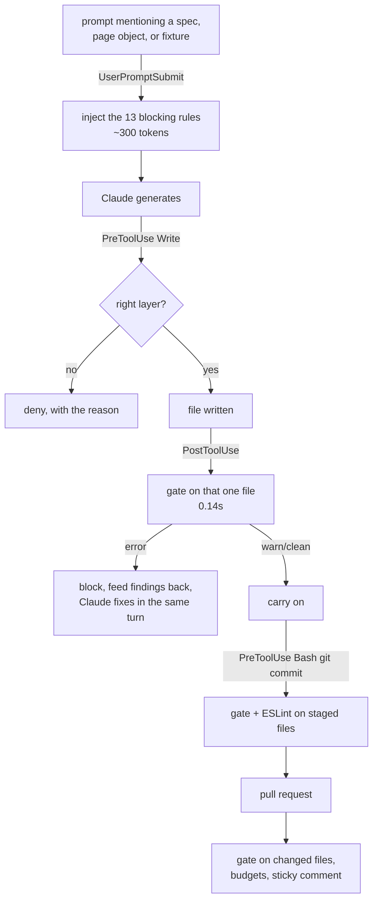

# Quality Gates

A proposal, and the implementation of it, for keeping generated test code
honest. Four gates, one rule engine, and three places they fire.

## The problem this solves

Nothing in a Playwright pipeline objects to a spec that asserts nothing. `tsc`
compiles it, ESLint has no rule for it, the suite reports it green, and CI goes
blue. A reviewer objects, once, and then gets tired. That is the gap generated
code walks through, and it widens with the volume of code an agent can produce.

The four gates are the four things reviewers keep saying by hand:

| Gate | The question it asks |
|---|---|
| **ai-slop** | Was this generated, skimmed, and shipped? |
| **ponytail** | Does anything else in the run already record this? |
| **over-engineering** | How many callers does this abstraction have? |
| **framework-patterns** | Is this still part of this framework? |

## Where they fire



Four stages, one CLI. The PR comment can never disagree with the terminal
because both come from the same run of `quality/gate.mjs`.

| Stage | Runs | Consequence | Cost |
|---|---|---|---|
| Prompt submitted | `inject-rules.mjs` | The 13 blocking rules enter context | ~40ms |
| Before a Write | `guard-file-placement.mjs` | Deny a spec outside `src/tests/` | ~30ms |
| After Write/Edit | `gate-on-edit.mjs` | `error` blocks the edit; `warn` is printed | ~140ms |
| Before a commit | `gate-on-commit.mjs` | Gate + ESLint on staged files | ~3s |
| Pull request | `quality-gate.yml` | Gate on changed files, budgets enforced | ~1min |

### Why ESLint is not in the edit hook

A type-aware lint of a single file costs **2.2 seconds**; the rule engine costs
**0.14**. Paying two seconds on every edit buys nothing the engine has not
already caught, so ESLint runs at commit time and in CI, where it is free. This
is the kind of decision worth writing down, because the obvious version of this
system runs everything everywhere and is abandoned in a week.

## The two tools, and the line between them

| Tool | Owns | Example |
|---|---|---|
| **ESLint** | Known-bad API use with a correct answer | floating promise, `waitForTimeout`, `force: true`, `any` |
| **`quality/` engine** | Judgement that needs the repo's shape | is this used twice, does this comment add anything, does this spec go through the fixture |

A hard wait is the most recognisable AI tell there is, and it is deliberately
**not** in the ai-slop pack: `playwright/no-wait-for-timeout` already owns it.
One owner per rule, or the report says everything twice and people stop reading.

## The rule engine

```
quality/
  gate.mjs              the one entry point every stage calls
  gate.config.mjs       include/exclude, severity overrides, profiles
  selftest.mjs          proves the rules still fire
  engine/
    source.mjs          lexer: masks strings and comments, keeps line offsets
    repo-index.mjs      import graph across the repo, aliases read from tsconfig
    detectors.mjs       12 primitives a rule can be built from
    run.mjs             rule loading, scoping, waivers, budgets
    report.mjs          console / hook / markdown / json
rules/
  ai-slop.rules.mjs
  ponytail.rules.mjs
  over-engineering.rules.mjs
  framework-patterns.rules.mjs
```

**Zero dependencies**, on purpose. This runs on every Claude edit, so the cost of
starting it is the cost of the gate.

Three design decisions carry the whole thing:

**Detectors are code, rules are data.** Adding "no `page.pause()` in specs" is a
four-line change in a rule pack, not a change to the engine. A detector is only
written when a regex genuinely cannot express the idea.

**The masked source.** The lexer walks each file once and produces a copy where
comment bodies and string contents are blanked, newlines preserved so every
offset still maps to its line. Rules run against that by default. It is the one
thing that separates a usable gate from a noisy one: `waitForTimeout` in a doc
comment is documentation, in a string it is a log message, and only in code is
it a finding.

**The whole repo is always indexed, even for one file.** "Nothing imports this
export" and "this helper has one caller" are unanswerable from inside the file
that defines them. Scoping happens at report time, not scan time.

### Profiles

The same rules run at every stage; only the consequence changes.

| Profile | Fails on | Budgets | Used by |
|---|---|---|---|
| `hook` | error | none | the Claude edit hook |
| `commit` | error | none | `npm run gate`, pre-commit |
| `ci` | error | per-gate warning caps | the PR gate |
| `audit` | nothing | none | whole-repo baseline |

Budgets are **per change, not per repo**: a pull request may carry a few
judgement-call warnings, not a pile of them. `ai-slop` 6, `ponytail` 8,
`over-engineering` 6, `framework-patterns` 4.

### Waivers

```ts
// gate-allow ponytail/attaches-what-the-trace-holds -- the diff is computed here, the trace has neither side
await testInfo.attach('shape-diff', { body: diff });
```

**A waiver without a reason is itself an error.** A gate that can be switched off
silently stops being a gate, and the reason is what a reviewer reads six months
later. Waived findings are still listed in the report, under their reasons,
rather than disappearing.

## Calibration

The first run produced **174 findings** on existing code. Reading all of them
found three classes of rule that were wrong, not three hundred problems:

| Symptom | Root cause | Fix |
|---|---|---|
| 67 emoji findings in one file | `CustomReporter.ts` renders a console and HTML report; the emoji are presentation | excluded by name, reason in the rule |
| Explanatory comments flagged as narration | overlap was divided by the smaller word set, so a short code line inside a long comment scored 1.0 | measure how much of the **comment** the code already says: the comment is the denominator |
| The logging wrapper told not to log | the ponytail premise is "the trace already has it", and the trace does not cover helper internals | scoped the rule to specs and page objects |

That took it to **73**, which were read individually and are real. Prefer
narrowing a rule's scope over adding an exclusion: an exclusion says "not here",
a scope says "here is where the premise holds".

### The acid test

`booking-crud-end-to-end.ponytail.spec.ts` (33 lines) reports **clean**. Its
73-line twin, which the README documents as carrying exactly this redundancy,
reports precisely the cuts the README's own table lists: logs restating step
names, attachments the trace already holds. The gate agrees with the repo's
existing written judgement, which is the only evidence that the rules are not
one person's taste.

## Adopting this on an existing suite

A gate switched on over a suite that predates it fails immediately, and the
first response is to weaken the gate. This one is introduced on changed files
only, which is why `--changed` and not `--all` runs on a pull request.

The whole-repo baseline at the time of writing, recorded so it can be paid down
deliberately rather than discovered:

| Check | Baseline | Note |
|---|---|---|
| `quality/gate.mjs --all` | 7 error, 57 warn, 9 info | every one read by hand during calibration |
| `eslint src playwright.config.ts` | 13 error, 21 warn | 9 auto-fixable with `--fix` |
| `tsc --noEmit` | clean | |

So `npm run lint` and `npm run gate` do **not** pass on the whole repo today,
and that is the honest state rather than a bug. What matters is that a pull
request cannot add to either number. Pay the baseline down file by file as you
touch them; a sweep that reformats forty files to get one number to zero is a
review problem, not an improvement.

## Running it

```bash
npm run gate                        # whole repo, commit profile
npm run gate -- --file src/pages/CartPage.ts
npm run gate:staged                 # what you are about to commit
npm run gate:changed                # what this branch adds, with CI budgets
npm run gate:audit                  # everything, fails on nothing
npm run gate:rules                  # every rule and its severity
npm run gate:install-hooks          # git pre-commit, for commits not made by Claude
npm run lint                        # ESLint
npm run verify                      # typecheck + lint + gate
node quality/selftest.mjs           # the rules still fire
```

## The skills

Six, in `.claude/skills/`. Each is loaded by task, not by gate:

| Skill | Use for |
|---|---|
| `quality-gate` | running and interpreting all of it |
| `ai-slop-review` | reviewing generated code before it merges |
| `ponytail-review` | cutting a spec that is mostly ceremony |
| `over-engineering-review` | deciding whether an abstraction earns its place |
| `framework-pattern-review` | onboarding code into the framework's shape |
| `quality-rule-author` | adding, tuning, or retiring a rule |

They carry what the rules cannot: what the gate **cannot** see and you still
have to read for (assertions that cannot fail, a title and body that disagree,
coverage theatre), and what must never be "simplified" (`UtilElementLocator`,
`BasePage`).

## Learning it

[`quality-gates-tutorial.html`](quality-gates-tutorial.html) next to this file is a twelve-lesson
study guide that builds the whole system from nothing, in the order it was actually built: the masked
lexer first, then rules as data, then the four packs, then waivers and budgets, then the hooks, then
CI. It carries the mistakes as well as the result, including the overlap metric that was wrong and
the glob translator that reported a clean repo because it matched nothing.

`exercises/` is the runnable half. Lessons 03, 04, 07 and 08 are stubs checked against the real
engine and the real import graph; the rest check the artifact each lesson adds to the repo.

```bash
npm run exercises          # 8 passing, 4 to do, 0 failing on a clean clone
npm run exercises -- 07
```

## Adding a rule

See `.claude/skills/quality-rule-author/SKILL.md`. In short: add the rule to a
pack, add code that trips it to `quality/__tests__/fixtures/slop-spec.fixture.txt`,
add its id to `quality/selftest.mjs`, run the audit and read every hit.

The clean fixture must stay clean. If a new rule fires on it, the rule is wrong.
